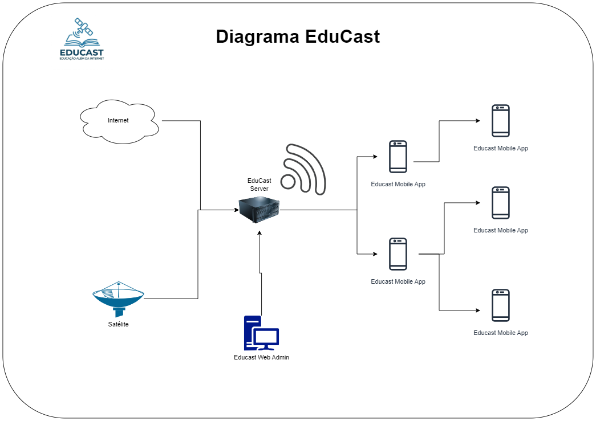
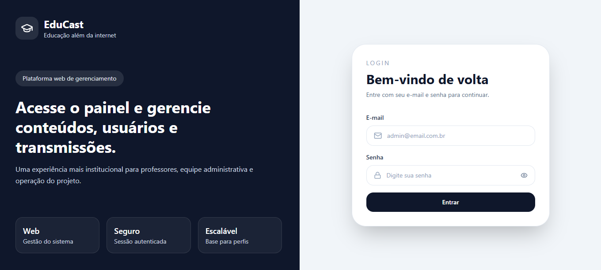
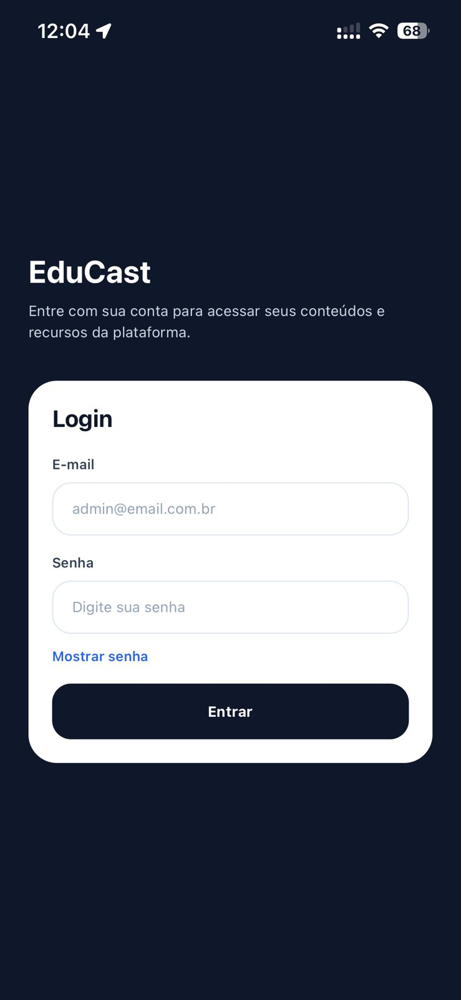

# EduCast

O **EduCast** nasce do desafio Hackathon com o tema:

> **"Auxílio aos professores e professoras no ensino público"**

O objetivo é desenvolver uma plataforma tecnológica que facilite o ensino em regiões com acesso limitado à internet, promovendo inclusão digital e acesso ao conteúdo educacional.

---

## 📌 Visão Geral

O EduCast é composto por **quatro camadas principais**:

- 📦 Backend (API + Banco de Dados)
- 📱 Frontend Mobile (App para alunos/professores)
- 🌐 Frontend Web (Painel administrativo e gestão)
- 📡 DevOps / Streaming (`educast_nginx_rtmp` para RTMP, HLS/DASH e MP4 on-demand)

A proposta é permitir a distribuição de conteúdo educacional mesmo em cenários com baixa conectividade, utilizando CDN local e sincronização de dados.

---

## 🧠 Problema

O Brasil possui regiões com acesso limitado à internet, dificultando o ensino remoto e híbrido.

---

## 💡 Solução

O EduCast permite:

- Distribuição de conteúdo via CDN local
- Consumo de aulas mesmo com baixa conexão
- Integração com transmissões ao vivo
- Organização de conteúdo educacional


---


## 🚀 Funcionalidades

### ✔️ Atuais

- Transmissão de aulas ao vivo
- Mural de comunicados
- Consumo de conteúdo educacional

### 🔮 Futuras

- Sistema de notas
- Registro de presença via QR Code
- Chat de vídeo local
- Sistema de exercícios
- Interação em tempo real entre alunos e professores

---

## 📸 Demonstração do Projeto

### 🌐 Frontend Web

Tela de login do painel administrativo:



---

### 📱 Frontend Mobile

Tela de login do aplicativo:



---

## 🧩 Estrutura do Projeto

```
EduCast/
├── 📦 backend/                    # API Node.js + Banco de Dados
│   ├── src/
│   │   ├── config/               # Configurações
│   │   ├── controllers/          # Lógica de controle
│   │   ├── models/               # Modelos de dados
│   │   ├── routes/               # Rotas da API
│   │   ├── middleware/           # Middleware (autenticação, etc)
│   │   └── services/             # Serviços de negócio
│   ├── tbsBoard/                # Instruções para preparação do servidor com a placa TBS
│   ├── mysql_data/               # Dados do banco de dados
│   ├── uploads/                  # Arquivos enviados
│   ├── docker-compose.yml        # Orquestração de containers
│   ├── Dockerfile                # Imagem Docker
│   ├── package.json              # Dependências Node.js
│   ├── app.js                    # Aplicação Express
│   └── server.js                 # Entrada do servidor
│
├── 📱 frontend-mobile/           # App React Native (Expo)
│   ├── src/
│   │   ├── screens/              # Telas do aplicativo
│   │   ├── services/             # Serviços (API, storage)
│   │   └── store/                # Estado global (Zustand)
│   ├── App.tsx                   # Componente principal
│   ├── package.json              # Dependências
│   └── tsconfig.json             # Configuração TypeScript
│
├── 🌐 frontend-web/              # Painel administrativo (React + Vite)
│   ├── src/
│   │   ├── pages/                # Páginas da aplicação
│   │   ├── routes/               # Roteamento
│   │   ├── services/             # Serviços (API)
│   │   ├── store/                # Estado global (Zustand)
│   │   ├── App.jsx               # Componente principal
│   │   ├── main.jsx              # Entrada
│   │   └── index.css             # Estilos globais
│   ├── index.html                # HTML principal
│   ├── package.json              # Dependências
│   ├── vite.config.js            # Configuração Vite
│   └── eslint.config.js          # Linting
│
├── 📡 devops/                    # Servidor de streaming com o container `educast_nginx_rtmp`
│   ├── docker-compose.yml        # Orquestração do streaming
│   ├── Dockerfile                # Imagem do nginx-rtmp
│   ├── nginx.conf                # Configuração RTMP + HLS + DASH + on-demand
│   ├── live/                     # Vídeos locais usados para simular canais ao vivo
│   ├── ondemand/                 # Biblioteca MP4 servida sob demanda
│   └── README.MD                 # Documentação do container de streaming
│
├── 🎨 assets/                    # Imagens e recursos visuais
├── README.MD                     # Documentação principal
```

**Descrição dos componentes principais:**

| Componente | Descrição | Tecnologia |
|-----------|-----------|-----------|
| **Backend** | API RESTful, autenticação, banco de dados | Node.js, Express, MySQL, JWT |
| **Frontend Mobile** | Aplicativo para alunos e professores | React Native, TypeScript, Expo |
| **Frontend Web** | Painel administrativo e gestão | React, Vite, TailwindCSS |
| **DevOps / Streaming** | Container `educast_nginx_rtmp` para RTMP, HLS/DASH ao vivo e MP4 on-demand | Docker, Nginx RTMP, FFmpeg |

---

## 🛠️ Tecnologias

### Backend
- Node.js
- Express
- MySQL
- Sequelize
- JWT
- Swagger
- Docker

### Frontend Mobile
- React Native + Expo
- TypeScript
- Axios
- Zustand
- AsyncStorage

### Frontend Web
- React (Vite)
- React Router
- Axios
- Zustand
- Tailwind CSS

---

# ⚙️ Como rodar o projeto

## Streaming (`educast_nginx_rtmp`) — subir primeiro

Antes do backend e dos frontends, inicie o container de streaming no diretório `devops`:

```bash
cd devops
docker compose up --build -d
```

Esse passo sobe o container `educast_nginx_rtmp`, responsável por:

- receber/publicar RTMP na porta `1935`
- gerar saídas ao vivo em HLS e DASH
- servir vídeos MP4 da pasta `ondemand` pela porta `9090`

## 🔧 Backend

1. Após o streaming estar ativo, execute o comando docker no diretório `backend`
```bash
docker compose up --build
```
Omita a flag `-d` para conseguir visualizar os logs

2. Acessos
* Documentação: http://localhost:3000/api-docs
* DB PhpAdmin: http://localhost:8080

3. Usuários
Na primeira build ou inicialização do projeto existe o usuário `admin` default para gerenciar o projeto. O primeiro acesso pode ser acessado por
* Login: admin@email.com.br
* Password: educastadmin

---

## 📱 Frontend Mobile (Expo)

```bash
  cd frontend-mobile
  npm install
  npx expo start
```
* 1=Admin, 2=Teacher, 3=Student, 4=School 1
Escaneie o QR Code com o Expo Go para ter acesso ao app em desenvolvimento.

---

## 🌐 Frontend Web

```bash
  cd frontend-web
  npm install
  npm run dev
```
Para acessar o frontend web **http://localhost:5173**

---

## 🔐 Variáveis de ambiente

Cada projeto possui sua próprias variáveis, no momento elas estão expostas para facilitar o desenvolvimento.
```bash
#Backend
PORT=3000

# Banco
DB_HOST=db
DB_USER=educast
DB_PASSWORD=educast
DB_NAME=educast
DB_PORT=3306

# Segurança
JWT_SECRET=educastsecret

# Admin padrão
ADMIN_DEFAULT_USERNAME=admin
ADMIN_DEFAULT_EMAIL=admin@email.com.br
ADMIN_DEFAULT_PASSWORD=educastadmin

# Swagger (ajustado para acessar via celular também)
SWAGGER_PROTOCOL=http
SWAGGER_HOST=192.168.4.51 ##usar o endereço IP da máquina
SWAGGER_PORT=3000
```

```bash
#Mobile
EXPO_PUBLIC_API_URL=http://SEU_IP_MAQUINA:3000
```
```bash
#Web
VITE_API_URL=http://localhost:3000
```
⚠️ Observações importantes

Para acessar pelo celular, utilize o IP da máquina (não localhost)
Certifique-se que backend e frontend estão na mesma rede
Expo Go deve estar atualizado

## Próximos passos
* Preparar o backend para interagir com o servidor e a placa, permitindo integração via API com outros sistemas
* Preparar um endpoint que indica quais vídeos estão disponíveis no ao vivo

Atividades
* Criação de upload para videos onDemand
* Separação de responsabilidade criando diretórios e arquivos para o swagger

